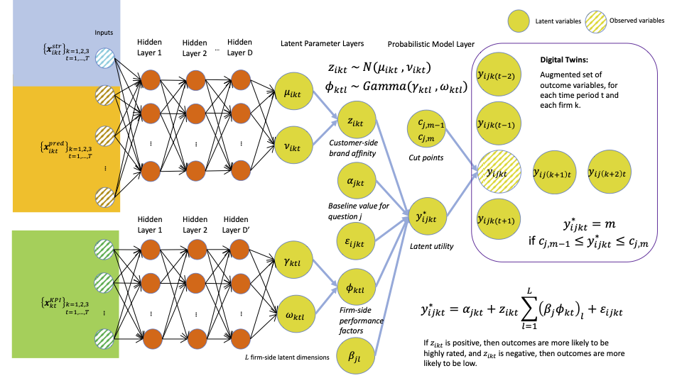
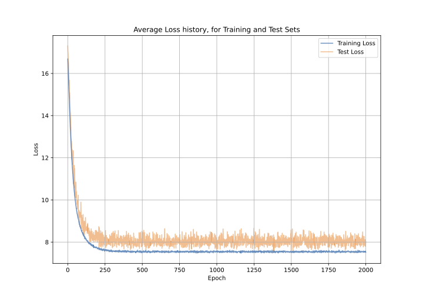

# Digital Marketing Twins Project Repository



## Overview

This project implements the novel methodology described in Samuel Levy's research paper on "Digital Marketing Twins." It uses deep generative models to analyze and predict customer behavior in counterfactual scenarios. The focus is on optimizing marketing strategies through the analysis of large-scale brand survey data from the U.S. wireless telecommunications market, but can be applied in any oligopolistic market. 

## File Descriptions


### `main.py`

- **Purpose**: Contains the core logic for model operation including initialization, training, evaluation, and prediction.
- **Components**:
  - **Model Definition**: Sets up the generative model and its guide for variational inference.
  - **Training and Testing Loops**: Manage the iterative process of training the model and evaluating its performance.
  - **Estimation Functions**: `estimate()` and `predictive()` functions manage the estimation of model parameters and making predictions, crucial for the exploration of counterfactual scenarios in marketing.

### `inout.py`

- **Purpose**: Manages the input and output operations related to data handling. It loads and preprocesses datasets to fit the model's requirements.
- **Functions**:
  - `load_dataset()`: Loads data and initializes datasets for model processing.
  - `fetch_all_u()` and `fetch_all_c()`: Fetch mini-batches of user and control data, respectively, facilitating efficient data processing during model training and testing.

### `model.py`


##### `model_full`

- **Description**: Implements the core deep generative model that utilizes Bayesian optimization and variational inference to predict customer behavior in counterfactual marketing scenarios.
- **Main Features**:
  - **Generative Model**: Constructs and trains a neural network-based model to simulate customer responses.
  - **Variational Inference**: Efficiently estimates model parameters and latent structures.
  - **Training Loop**: Manages data batching, epoch iterations, and performance evaluation using JAX's capabilities.
- **Usage**: Called within the main training loop to fit the model to data and refine marketing strategies based on simulated outcomes.

### `optim.py`

- **Purpose**: Implements optimization algorithms, particularly grid search, to maximize brand affinity and customer satisfaction.
- **Key Functions**:
  - `post_grid_search()`: Conducts grid search on posterior predictive distributions to identify optimal marketing strategies.
  - `post_latent_sites()`: Samples latent variables (`alpha`, `beta`, `phi`) from posterior distributions for further analysis.
  - `post_Y_predictive()`: Generates posterior predictive samples for customer-side brand affinity questions.
- **Usage**:
  - Call `post_grid_search` to identify optimal marketing strategies via Bayesian optimization.
  - Use `post_latent_sites` and `post_Y_predictive` to analyze posterior samples of latent variables and brand affinity questions.

### `sim.py`
- **Purpose**: Generate synthetic data.
  - `generate_synthetic_data()`: Generate synthetic "z" latent variables, from the common variables and neural network.
  - `generate_samples()`: generate samples for perceptual variables from the latent.
- **Usage**: when the user does not have any data, but wants to implement the model, he/she is allowed to generate synthetic data according to the model, due to its generative nature.


## Installation

To run the project, you need Python. First, clone the repository. For example:

```bash
git clone https://github.com/silevy/digitaltwins.git
```
Then, change directory to the package:

```bash
cd digitaltwins
```
Install the package with `pip`:

```bash
pip install .[cpu]
```
If you have access to GPU, you can run this instead:

```bash
pip install .[gpu]
```

Ensure that your environment is set up with the appropriate versions of these libraries to avoid compatibility issues. We recommend training on GPU, with CUDA installed. 

## Usage

To generate simulated data, run the following:

```bash
run-sim
```
This command generates different datasets, stored under a new folder named `simulated_data`.

To start using the project, and estimating the model, run the following:

```bash
run-main
```

You can modify the script or use command-line arguments to customize the model's behavior, such as adjusting the number of training epochs or setting different hidden layers or hidden dimensions.

The loss function is as follows:



## Contribution

Contributions to this project are welcome! Please fork the repository, make your changes, and submit a pull request. For major changes, please open an issue first to discuss what you would like to change.

## License

This project is licensed under the MIT License - see the LICENSE file for details.

